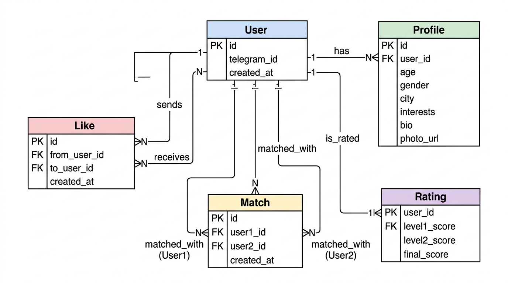

# Документация проекта: Dating Bot

## 1. Общее описание

Цель проекта — разработка Telegram-бота для знакомств с системой анкет и ранжирования пользователей.

Система позволяет:

* регистрировать пользователей через Telegram
* создавать и редактировать анкеты
* просматривать анкеты других пользователей
* ставить лайки/пропуски
* формировать мэтчи
* ранжировать анкеты

---

## 2. Архитектура системы

Система построена по модульному принципу и состоит из следующих компонентов:

### 2.1 Компоненты

1. **Telegram Bot**

   * Интерфейс взаимодействия с пользователем
   * Обрабатывает команды (/start, лайки, просмотр анкет)

2. **Backend API (FastAPI)**

   * Основная бизнес-логика
   * Обработка запросов от бота
   * Работа с базой данных

3. **PostgreSQL**

   * Основное хранилище данных
   * Содержит пользователей, анкеты, лайки, мэтчи, рейтинги

4. **Redis**

   * Кэширование анкет
   * Ускорение выдачи рекомендаций

5. **Celery**

   * Фоновые задачи
   * Пересчет рейтинга пользователей

6. **RabbitMQ**

   * Очередь сообщений
   * Передача событий (лайки, мэтчи)

7. **S3 (MinIO)**

   * Хранение изображений пользователей

---

## 3. Взаимодействие компонентов

### Основной сценарий:

1. Пользователь отправляет команду в Telegram
2. Бот отправляет запрос в Backend API
3. Backend:

   * обрабатывает логику
   * обращается к БД
   * при необходимости к Redis
4. При событиях (лайк):

   * событие отправляется в RabbitMQ
   * Celery обрабатывает событие
   * обновляет рейтинг

---

## 4. Схема базы данных

### 4.1 User

* id (PK)
* telegram_id
* created_at

### 4.2 Profile

* id (PK)
* user_id (FK)
* age
* gender
* city
* interests
* bio
* photo_url

### 4.3 Like

* id (PK)
* from_user_id (FK)
* to_user_id (FK)
* created_at

### 4.4 Match

* id (PK)
* user1_id (FK)
* user2_id (FK)
* created_at

### 4.5 Rating

* user_id (PK)
* level1_score
* level2_score
* final_score

---

## 5. Алгоритм ранжирования

### Уровень 1: Базовый

* совпадение по возрасту
* совпадение по полу
* совпадение по городу
* заполненность анкеты

### Уровень 2: Поведенческий

* количество лайков
* количество пропусков
* коэффициент лайков

### Уровень 3: Комбинированный

* итоговый рейтинг = 0.5 * level1 + 0.5 * level2

---

## 6. Кэширование (Redis)

* При начале сессии пользователю подгружается список анкет (например, 10)
* Анкеты сохраняются в Redis
* При просмотре бот берет анкеты из кэша
* При окончании списка — повторная загрузка

---

## 7. Фоновые задачи (Celery)

Используются для:

* пересчета рейтинга
* обработки событий из очереди

---

## 8. Очереди сообщений (RabbitMQ)

Используются для:

* передачи событий лайков
* асинхронной обработки

---

## 9. Хранение изображений

* Все изображения сохраняются в S3 (MinIO)
* В базе хранится только ссылка

---

## 10. Репозиторий

Проект размещен в GitHub-репозитории.

Структура проекта:

* bot/
* backend/
* db/
* docker/
* tests/

---

## 11. Технический стек

### Backend

* Python 3.11
* FastAPI — REST API
* SQLAlchemy — ORM

### База данных

* PostgreSQL — основное хранилище

### Кэширование

* Redis — кэш анкет и промежуточных данных

### Очереди и асинхронность

* RabbitMQ — брокер сообщений
* Celery — обработка фоновых задач

### Хранилище файлов

* MinIO (S3-совместимое хранилище)

### Инфраструктура

* Docker / Docker Compose
* GitHub Actions (CI/CD)

---

## 12. Схема базы данных (ER-диаграмма)



---

## 13. Архитектура системы (микросервисный подход)

Система разделена на логические микросервисы, каждый из которых отвечает за свою область ответственности.

### 13.1 Список микросервисов

#### 1. Bot Service (Telegram Bot)

* Обрабатывает команды пользователя
* Отправляет запросы в Backend API
* Отображает анкеты, лайки, мэтчи

#### 2. API Gateway / Backend Service (FastAPI)

* Центральная точка входа
* Обрабатывает бизнес-логику
* Делегирует задачи другим сервисам
* Работает с БД, Redis и MQ

#### 3. Profile Service

* CRUD операций с анкетами
* Валидация данных
* Работа с PostgreSQL

#### 4. Matchmaking Service

* Подбор анкет
* Фильтрация по предпочтениям
* Сортировка по рейтингу
* Использует Redis для кэша

#### 5. Rating Service

* Расчет рейтингов (3 уровня)
* Получает события из RabbitMQ
* Пересчитывает и сохраняет рейтинг

#### 6. Media Service

* Загрузка изображений
* Работа с MinIO (S3)
* Возврат URL изображений

#### 7. Event Service (MQ Layer)

* RabbitMQ
* Принимает события (лайк, мэтч)
* Передает их в Celery

#### 8. Worker Service (Celery)

* Обрабатывает фоновые задачи
* Пересчет рейтинга
* Обработка событий


```
                    ┌───────────────┐
                    │ Telegram User │
                    └──────┬────────┘
                           │
                           ▼
                    ┌───────────────┐
                    │ Telegram Bot  │
                    └──────┬────────┘
                           │ HTTP
                           ▼
                    ┌────────────────┐
                    │  API Gateway   │
                    │   (Backend)    │
                    └──────┬─────────┘
         ┌─────────────────┼──────────────────────┐
         ▼                 ▼                      ▼
┌────────────────┐ ┌──────────────────┐  ┌──────────────────┐
│ Profile Service│ │ Matchmaking Svc  │  │   Media Service  │
└──────┬─────────┘ └──────┬───────────┘  └────────┬─────────┘
       │                  │                       │
       ▼                  ▼                       ▼
 ┌───────────┐      ┌──────────┐           ┌──────────────┐
 │ Postgres  │      │  Redis   │           │    MinIO     │
 └───────────┘      └──────────┘           │ (S3 storage) │
                                           └──────────────┘
                ┌──────────────────────────────┐
                │      Event Service           │
                │        (RabbitMQ)            │
                └─────────────┬────────────────┘
                              ▼
                      ┌──────────────┐
                      │ Worker Svc   │
                      │   (Celery)   │
                      └──────┬───────┘
                             ▼
                      ┌──────────────┐
                      │ Rating Svc   │
                      │  (compute)   │
                      └──────┬───────┘
                             ▼
                        ┌──────────┐
                        │ Postgres │
                        └──────────┘
```
---

### 13.2 Взаимодействие микросервисов

#### Сценарий: регистрация

Bot → Backend → PostgreSQL

#### Сценарий: создание анкеты

Bot → Backend → Profile Service → PostgreSQL

#### Сценарий: просмотр анкет

Bot → Backend → Matchmaking Service
Matchmaking Service:

* проверяет Redis
* если нет → берет из PostgreSQL
* сохраняет в Redis

#### Сценарий: лайк

Bot → Backend → PostgreSQL (сохраняем лайк)
Backend → RabbitMQ (событие лайка)
RabbitMQ → Celery Worker
Celery → Rating Service → PostgreSQL (обновление рейтинга)

#### Сценарий: загрузка фото

Bot → Backend → Media Service → MinIO
→ ссылка сохраняется в PostgreSQL

---

### 13.3 Потоки данных (упрощенно)

```
User → Bot → Backend

Backend → PostgreSQL
Backend → Redis
Backend → RabbitMQ

RabbitMQ → Celery → Rating Service → PostgreSQL

Backend → MinIO
```

---

## 14. Схема дизайна системы (потоки данных)

Схема дизайна системы (потоки данных)

### Сценарий: просмотр анкет

1. Пользователь запрашивает анкету
2. Backend проверяет Redis:

   * если есть → отдает из кэша
   * если нет → берет из БД
3. Backend отправляет список анкет в Redis
4. Бот показывает анкету

---

### Сценарий: лайк

1. Пользователь ставит лайк
2. Backend:

   * записывает в БД
   * отправляет событие в RabbitMQ
3. Celery:

   * получает событие
   * пересчитывает рейтинг

---

### Сценарий: загрузка фото

1. Пользователь отправляет фото
2. Backend загружает файл в MinIO
3. Ссылка сохраняется в БД

---

