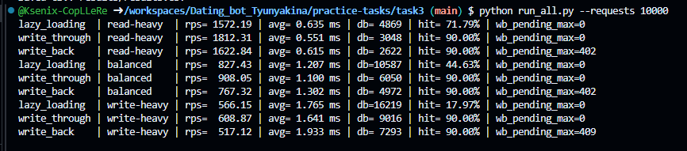
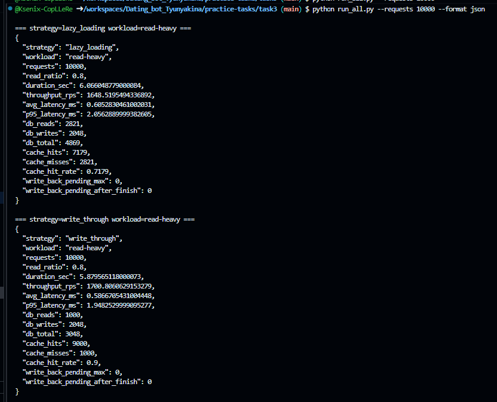

# Отчет по практике: сравнение типов кеширования

## Цель работы

Цель работы - реализовать одну и ту же систему в трех вариантах кеширования и сравнить их в одинаковых условиях.

Сравниваемые стратегии:

- `Lazy Loading / Cache-Aside / Write-Around`;
- `Write-Through`;
- `Write-Back`.

## Архитектура

Используется следующая связка:

```text
load-generator -> Python functions -> Redis -> SQLite
```

Компоненты:

- `load_generator.py` - генерирует одинаковую нагрузку и собирает метрики;
- `run_all.py` - запускает все эксперименты;
- `cache_strategies.py` - содержит реализации трех стратегий кеширования;
- `storage.py` - отвечает за SQLite и считает обращения к БД;
- Redis - кеш;
- SQLite - постоянное хранилище.

## Описание тестов

Для всех стратегий использовались одинаковые параметры:

- размер начального набора данных: `1000` товаров;
- количество запросов на один прогон: `10000`;
- seed генератора операций: `42`;
- Redis URL: `redis://localhost:6379/0`;
- параметр `write-back-flush-every`: `500`;
- дата и время проведения теста: `____`;
- компьютер / ОС: `____`;
- версия Python: `3.10.11`;

Были выполнены три типа нагрузки:

| Нагрузка | Доля чтений | Доля записей |
|---|---:|---:|
| `read-heavy` | 80% | 20% |
| `balanced` | 50% | 50% |
| `write-heavy` | 20% | 80% |

Всего выполнено 9 экспериментов:

```text
3 стратегии * 3 типа нагрузки = 9 прогонов
```

## Результаты измерений

Тест был запущен командой:

```bash
python run_all.py --requests 10000
```

### Общая таблица

| Стратегия | Нагрузка | Requests | Throughput, req/sec | Avg latency, ms | DB reads | DB writes | DB total | Cache hits | Cache misses | Hit rate | WB pending max |
|---|---|---:|---:|---:|---:|---:|---:|---:|---:|---:|---:|
| Lazy Loading | read-heavy | 10000 | 1579.27 | 0.632 | 2821 | 2048 | 4869 | 7179 | 2821 | 71.79% | - |
| Write-Through | read-heavy | 10000 | 1684.64 | 0.592 | 1000 | 2048 | 3048 | 9000 | 1000 | 90.00% | - |
| Write-Back | read-heavy | 10000 | 1655.92 | 0.603 | 1000 | 1622 | 2622 | 9000 | 1000 | 90.00% | 402 |
| Lazy Loading | balanced | 10000 | 811.26 | 1.231 | 5537 | 5050 | 10587 | 4463 | 5537 | 44.63% | - |
| Write-Through | balanced | 10000 | 887.63 | 1.125 | 1000 | 5050 | 6050 | 9000 | 1000 | 90.00% | - |
| Write-Back | balanced | 10000 | 776.87 | 1.286 | 1000 | 3972 | 4972 | 9000 | 1000 | 90.00% | 402 |
| Lazy Loading | write-heavy | 10000 | 525.54 | 1.901 | 8203 | 8016 | 16219 | 1797 | 8203 | 17.97% | - |
| Write-Through | write-heavy | 10000 | 564.15 | 1.771 | 1000 | 8016 | 9016 | 9000 | 1000 | 90.00% | - |
| Write-Back | write-heavy | 10000 | 509.60 | 1.961 | 1000 | 6293 | 7293 | 9000 | 1000 | 90.00% | 409 |

Дополнительно измерялся `p95_latency_ms`:

| Стратегия | Нагрузка | P95 latency, ms |
|---|---|---:|
| Lazy Loading | read-heavy | 2.141 |
| Write-Through | read-heavy | 2.108 |
| Write-Back | read-heavy | 0.679 |
| Lazy Loading | balanced | 2.462 |
| Write-Through | balanced | 2.281 |
| Write-Back | balanced | 0.792 |
| Lazy Loading | write-heavy | 3.152 |
| Write-Through | write-heavy | 3.213 |
| Write-Back | write-heavy | 0.870 |

## Скриншоты консоли

Логи тестов в консоли.

Краткие логи:
```bash
python run_all.py --requests 10000
```



Подробные логи (отформатированный JSON):
```bash
python run_all.py --requests 10000 --format json
```



*на скриншоте первые два прогона из девяти

## Анализ результатов

### Read-heavy

Ожидаемая логика:

- при большом количестве чтений все стратегии должны получать пользу от Redis;
- `Write-Through` и `Write-Back` могут иметь более высокий hit rate после записей, потому что обновляют кеш при записи;
- `Lazy Loading` после записи удаляет кеш, поэтому часть следующих чтений может снова идти в SQLite.

Фактический вывод:

При нагрузке `read-heavy` лучший throughput показал `Write-Through`: 1684.64 req/sec. `Write-Back` оказался близко к нему: 1655.92 req/sec. `Lazy Loading` показал меньший throughput: 1579.27 req/sec.

По hit rate `Write-Through` и `Write-Back` дали 90.00%, а `Lazy Loading` только 71.79%. Это связано с тем, что `Lazy Loading` при записи удаляет значение из кеша, поэтому последующие чтения чаще снова обращаются к SQLite. По количеству обращений к БД лучший результат у `Write-Back`: 2622 обращения, затем `Write-Through`: 3048, затем `Lazy Loading`: 4869.

### Balanced

Ожидаемая логика:

- `Write-Through` дает консистентность кеша и БД, но каждая запись обращается к SQLite;
- `Write-Back` может дать меньшую задержку записи, но база обновляется позже;
- `Lazy Loading` остается простой стратегией, но при частых записях может чаще сбрасывать кеш.

Фактический вывод:

При смешанной нагрузке лучший throughput показал `Write-Through`: 887.63 req/sec. `Lazy Loading` показал 811.26 req/sec, `Write-Back` - 776.87 req/sec.

При этом по количеству обращений к БД `Write-Back` оказался лучше: 4972 обращения против 6050 у `Write-Through` и 10587 у `Lazy Loading`. Hit rate у `Write-Through` и `Write-Back` одинаковый - 90.00%, у `Lazy Loading` - 44.63%. Это показывает, что при частых записях стратегия сброса кеша в `Lazy Loading` сильно снижает эффективность кеша.

### Write-heavy

Ожидаемая логика:

- `Write-Back` обычно должен показывать лучшие задержки на запросах записи, потому что пишет в Redis и откладывает SQLite;
- у `Write-Through` будет много обращений к SQLite;
- у `Lazy Loading` записи идут в SQLite сразу, а кеш по обновленным ключам сбрасывается.

Фактический вывод:

При нагрузке `write-heavy` лучший throughput показал `Write-Through`: 564.15 req/sec. `Lazy Loading` показал 525.54 req/sec, `Write-Back` - 509.60 req/sec.

По обращениям к БД `Write-Back` был лучше остальных: 7293 обращения против 9016 у `Write-Through` и 16219 у `Lazy Loading`. Hit rate у `Write-Through` и `Write-Back` составил 90.00%, а у `Lazy Loading` только 17.97%. Несмотря на то, что в теории `Write-Back` часто выигрывает на записях, в данном конкретном прогоне общий throughput оказался ниже из-за накладных расходов на ведение dirty-ключей и периодический flush.

## Отложенные записи в Write-Back

Для `Write-Back` отдельно измеряется:

- `write_back_pending_max` - максимальное количество накопленных отложенных записей;
- `write_back_pending_after_finish` - количество отложенных записей после завершения теста.

Результат:

| Нагрузка | WB pending max | WB pending after finish |
|---|---:|---:|
| read-heavy | 402 | 0 |
| balanced | 402 | 0 |
| write-heavy | 409 | 0 |

Вывод по накоплению записей:

В `Write-Back` во время теста действительно накапливались отложенные записи: максимум 402-409 товаров одновременно ожидали записи в SQLite. После завершения каждого теста значение `write_back_pending_after_finish` равно 0, значит финальный flush успешно сбросил все накопленные изменения в базу.

## Итоговые выводы

### Что лучше для чтения

По результатам `read-heavy` нагрузки для чтения лучше всего показал себя `Write-Through`: 1684.64 req/sec и 90.00% hit rate. `Write-Back` был близок по throughput и имел такой же hit rate. `Lazy Loading` уступил из-за сброса кеша при записях.

Ожидаемо для чтения хорошо подходят все стратегии, если данные уже прогреты в Redis. При частых обновлениях лучше могут выглядеть `Write-Through` и `Write-Back`, потому что они обновляют кеш при записи.

### Что лучше для записи

По количеству обращений к БД при write-heavy нагрузке лучше показал себя `Write-Back`: 7293 обращения к БД против 9016 у `Write-Through` и 16219 у `Lazy Loading`. Однако по фактическому throughput в этом запуске лидировал `Write-Through`: 564.15 req/sec. Поэтому в данном эксперименте `Write-Through` оказался быстрее по времени выполнения, а `Write-Back` лучше снизил нагрузку на БД.

Ожидаемо для записи лучший throughput может показать `Write-Back`, потому что запись сначала идет в Redis, а SQLite обновляется позже.

### Что лучше для смешанной нагрузки

Для смешанной нагрузки лучший throughput показал `Write-Through`: 887.63 req/sec. Но `Write-Back` дал меньше обращений к БД: 4972 против 6050. Если важна максимальная скорость в данном запуске и строгая синхронность с БД, лучше выбрать `Write-Through`. Если важнее снижать нагрузку на SQLite и допустима отложенная запись, лучше подходит `Write-Back`.

Ожидаемо для смешанной нагрузки выбор зависит от требований к консистентности. Если нужна немедленная запись в БД, лучше `Write-Through`. Если важнее скорость записи и допустима задержка синхронизации с БД, лучше `Write-Back`.

## Команды запуска

Установка зависимостей:

```bash
python -m pip install -r requirements.txt
```

Запуск Redis должен быть выполнен до тестов:

```bash
docker run --name cache-tests-redis -p 6380:6379 redis:7
```

Полный запуск всех измерений:

```bash
python run_all.py --requests 10000
```

Результаты сохраняются в:

```text
results/results.csv
```
