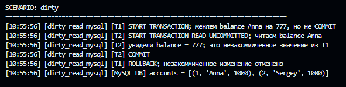
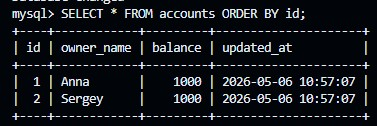
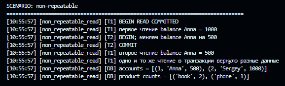
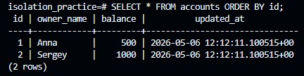
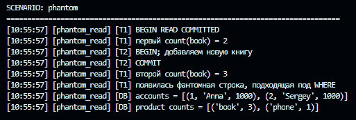
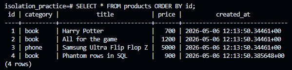
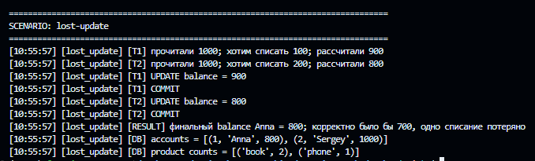
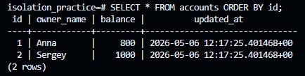
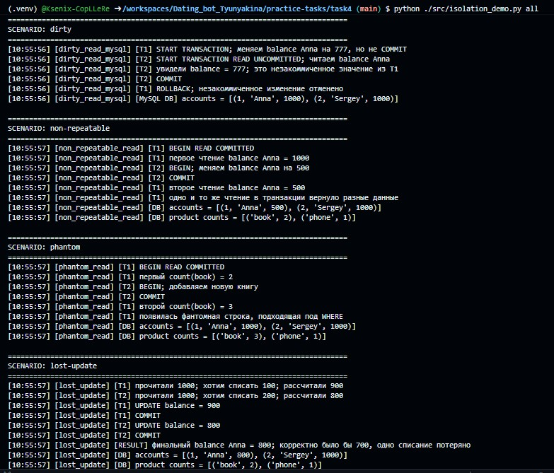

# Отчет по практической работе

## Тема

Аномалии изоляции транзакций в SQL на примере PostgreSQL и MySQL.

## Цель

Показать на практике, что при параллельной работе с базой данных могут возникать аномалии изоляции транзакций, а также описать способы их предотвращения.

## Используемые инструменты

- Язык программирования: Python 3.
- База данных: PostgreSQL для `non-repeatable read`, `phantom read`, `lost update`.
- База данных: MySQL для `dirty read`.
- Библиотеки подключения: `psycopg2`, `mysql-connector-python`.
- Способ запуска БД: Docker Compose.

## Выбранные аномалии

В работе рассмотрены четыре случая:

- `dirty read` - воспроизводится в MySQL на уровне `READ UNCOMMITTED`;
- `non-repeatable read`;
- `phantom read`;
- `lost update`.

## SQL-скрипт подготовки данных

Файлы:

- `sql/01_schema.sql` - подготовка PostgreSQL для трех сценариев;
- `sql/02_mysql_dirty_schema.sql` - подготовка MySQL для `dirty read`.

Скрипты пересоздают таблицы, затем добавляют тестовые данные.

Таблица `accounts` в PostgreSQL используется для сценариев `non-repeatable read` и `lost update`.

Таблица `accounts` в MySQL используется для сценария `dirty read`.

Таблица `products` используется для сценария `phantom read`.

## 1. Dirty read

### Описание

`Dirty read` - это ситуация, когда одна транзакция читает изменения другой транзакции, которые еще не были зафиксированы через `COMMIT`.

### Шаги воспроизведения

1. `T1` начинает транзакцию.
2. `T1` меняет баланс Anna с `1000` на `777`, но не фиксирует изменение.
3. `T2` начинает транзакцию с уровнем `READ UNCOMMITTED`.
4. `T2` читает баланс Anna.
5. `T1` отменяет изменение через `ROLLBACK`.

### Полученный результат

В MySQL грязное чтение произошло. Транзакция `T2` увидела значение `777`, хотя транзакция `T1` еще не выполнила `COMMIT`. После этого `T1` сделала `ROLLBACK`, и финальное значение снова стало `1000`.


```bash
python ./src/isolation_demo.py dirty
```

Логи:



БД:




### Как избежать

Чтобы избежать `dirty read`, не нужно использовать уровень `READ UNCOMMITTED`. В MySQL достаточно запускать транзакции на уровне `READ COMMITTED` или выше. В PostgreSQL грязное чтение не возникает даже при `READ UNCOMMITTED`, потому что этот уровень фактически работает как `READ COMMITTED`.

## 2. Non-repeatable read

### Описание

`Non-repeatable read` - это ситуация, когда транзакция два раза читает одну и ту же строку, но получает разные значения, потому что другая транзакция изменила и зафиксировала эту строку.

### Шаги воспроизведения

1. `T1` начинает транзакцию `READ COMMITTED`.
2. `T1` читает баланс Anna и видит `1000`.
3. `T2` начинает транзакцию.
4. `T2` меняет баланс Anna на `500`.
5. `T2` делает `COMMIT`.
6. `T1` повторно читает баланс Anna и видит `500`.

### Полученный результат

Один и тот же запрос внутри транзакции `T1` вернул разные значения.


```bash
python ./src/isolation_demo.py non-repeatable
```

Логи:



БД:




### Как избежать

Можно использовать уровень изоляции `REPEATABLE READ` или `SERIALIZABLE`. Если строка далее будет изменяться, можно заранее заблокировать ее через `SELECT ... FOR UPDATE`.

## 3. Phantom read

### Описание

`Phantom read` - это ситуация, когда транзакция два раза выполняет запрос по условию, но во второй раз получает новый набор строк, потому что другая транзакция добавила или удалила подходящие строки.

### Шаги воспроизведения

1. `T1` начинает транзакцию `READ COMMITTED`.
2. `T1` выполняет запрос `SELECT count(*) FROM products WHERE category = 'book'` и получает `2`.
3. `T2` начинает транзакцию.
4. `T2` добавляет новый товар категории `book`.
5. `T2` делает `COMMIT`.
6. `T1` повторяет запрос и получает `3`.

### Полученный результат

Во втором чтении появилась новая строка, подходящая под условие `WHERE category = 'book'`.


```bash
python ./src/isolation_demo.py phantom
```

Логи:




БД:




### Как избежать

Можно использовать уровень изоляции `REPEATABLE READ` для стабильного снимка данных в PostgreSQL или `SERIALIZABLE` для строгой сериализуемости. Также можно применять явные блокировки или перестраивать бизнес-логику так, чтобы параллельная вставка подходящих строк была невозможна.

## 4. Lost update

### Описание

`Lost update` - это ситуация, когда две транзакции читают одно и то же значение, независимо рассчитывают новое значение, а затем одна запись перезаписывает результат другой.

### Шаги воспроизведения

1. Начальный баланс Anna равен `1000`.
2. `T1` читает баланс `1000` и рассчитывает новое значение `900`.
3. `T2` читает баланс `1000` и рассчитывает новое значение `800`.
4. `T1` записывает `900` и делает `COMMIT`.
5. `T2` записывает `800` и делает `COMMIT`.
6. Финальный баланс становится `800`.

### Полученный результат

Корректный результат двух списаний `100` и `200` должен быть `700`, но фактический баланс равен `800`. Одно обновление было потеряно.


```bash
python ./src/isolation_demo.py lost-update
```

Логи:



БД:



### Как избежать

Можно использовать атомарное обновление:

```sql
UPDATE accounts
SET balance = balance - 100
WHERE id = 1;
```

Также можно применять `SELECT ... FOR UPDATE`, уровень изоляции `SERIALIZABLE` или оптимистическую блокировку через поле версии.

## Итог

В работе были рассмотрены четыре сценария. `Dirty read` был воспроизведен в MySQL на уровне `READ UNCOMMITTED`. Остальные аномалии были показаны в PostgreSQL на уровне `READ COMMITTED`.

Общий запуск всех сценариев:

```bash
python ./src/isolation_demo.py all
```



## Приложение. Команды запуска

```powershell
docker compose up -d
python -m venv .venv
source .venv/bin/activate
pip install -r requirements.txt
python ./src/isolation_demo.py dirty
python ./src/isolation_demo.py non-repeatable
python ./src/isolation_demo.py phantom
python ./src/isolation_demo.py lost-update
python ./src/isolation_demo.py all
```
